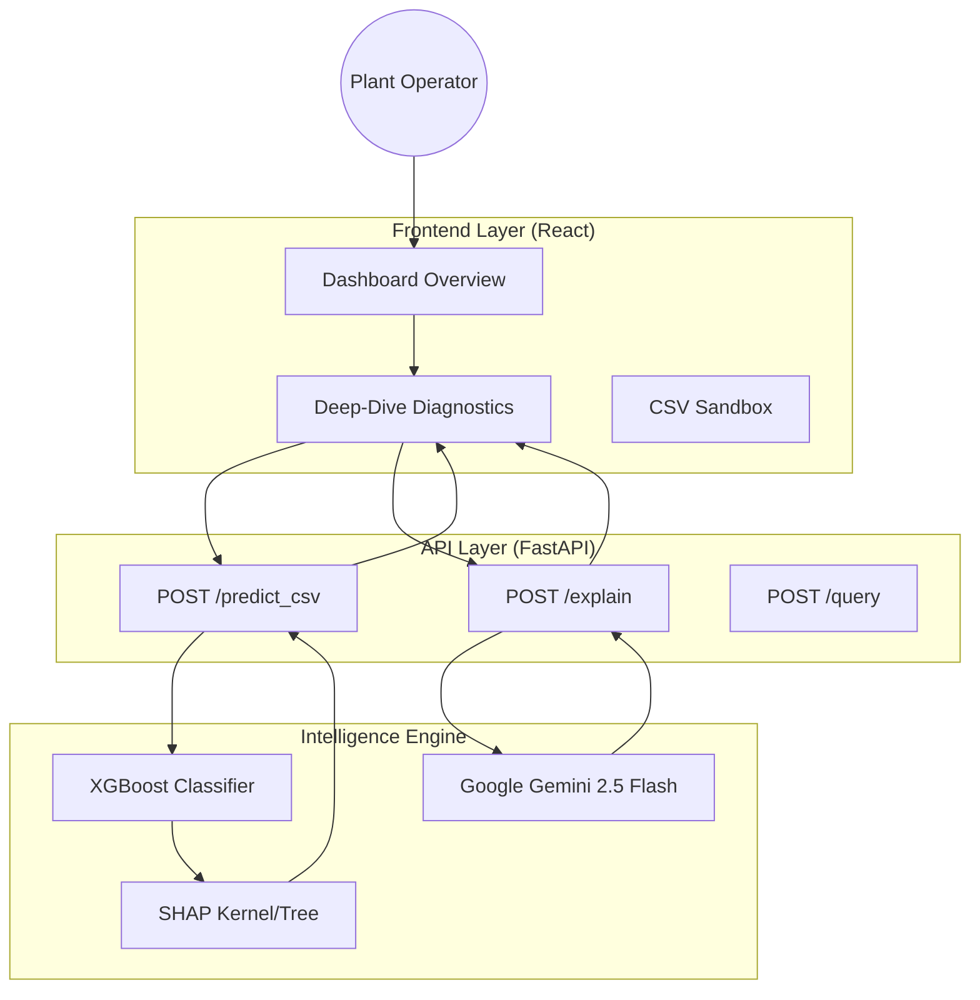

# ☀️ SolarSight: Enterprise-Grade AI Operations for Solar Assets
Name: Nisarg Gandhi
Phone No 8160364574
Email id: nisargg.1122@gmail.com
College: Nirma University
Year of Graduation: 2028

Name: Jemil Patel
Phone No 8469796250
Email id: jemilpatel4812@gmail.com
College: Nirma University
Year of Graduation: 2028

Name: Veer Shah
Phone No 8320569912
Email id: veershah611@gmail.com
College: Nirma University
Year of Graduation: 2028

Name: Prachi Lalwani
Phone No 7041274156
Email id: lalwaniprachi93@gmail.com
College: Nirma University
Year of Graduation: 2028

Name: Yashvi Hingrajiya
Phone No 9727027211
Email id: yashvihingrajiya14@gmail.com
College: Nirma University
Year of Graduation: 2028
> **Transforming Reactive Maintenance into Predictive Intelligence.**  
> SolarSight leverages advanced Gradient Boosting (XGBoost), Explainable AI (SHAP), and Generative LLMs (Gemini) to predict and diagnose solar inverter failures before they lead to energy loss.

---

## 📖 Table of Contents
- [Core Purpose & Problem Statement](#-core-purpose--problem-statement)
- [System Architecture](#-system-architecture)
- [Project Structure](#-project-structure)
- [Technical Deep Dive](#-technical-deep-dive)
- [Key Workflows](#-key-workflows)
- [Installation & Configuration](#-installation--configuration)
- [API Documentation](#-api-documentation)
- [Roadmap & Future Goals](#-roadmap--future-goals)
- [License](#-license)

---

## 🎯 Core Purpose & Problem Statement

Solar energy plants act as the backbone of modern renewable grids, but they suffer from **Reactive Maintenance Fatigue**. Currently, most operations teams detect inverter failures *after* they happen via basic threshold alarms. This leads to:
1.  **Irrecoverable Revenue Loss**: Energy not generated during downtime is lost forever.
2.  **Hardware "Pops"**: Unexpected high-thermal events that destroy expensive components.
3.  **Opaque AI**: Operators often don't trust automated flags because they don't understand the "Why."

**SolarSight solves this by:**
- Providing **7-10 day lead time** on impending failures.
- Offering **Explainable AI (XAI)** that surfaces the exact sensor (thermal, voltage, efficiency) causing the risk.
- Generating **Human-Readable Narratives** that bridge the gap between complex ML data and on-the-ground maintenance action.

---

## 🏗️ System Architecture

SolarSight follows a **Decoupled Micro-Frontend/Backend Architecture** designed for high-throughput telemetry processing and real-time AI inference.



### Component Interaction:
1.  **Telemetry Ingestion**: The backend processes raw industrial telemetry, engineering features like "7-day rolling thermal volatility."
2.  **Inference Pipeline**: Features are fed into the XGBoost model to generate a risk probability (0-100%).
3.  **Explainability Pipeline**: SHAP calculates the "Shapley Values," quantifying how much each sensor reading contributed to the final risk score.
4.  **Generative Feedback**: Gemini AI ingests the SHAP values and raw numbers to synthesize a plain-English report.

---

## 📂 Project Structure

```text
latent-space-hackamined/
├── .gitignore
├── README.md
├── REAL_hackathon_demo_data.csv
├── backend/
│   ├── .dockerignore
│   ├── .env
│   ├── Dockerfile
│   ├── docker-compose.yml
│   ├── dump_types.py
│   ├── models/
│   │   ├── feature_columns.json
│   │   └── xgboost_solar_model.pkl
│   ├── notebooks/
│   │   ├── 01_preprocessing.ipynb
│   │   └── 02_training.ipynb
│   ├── requirements.txt
│   ├── run.bat
│   ├── src/
│   │   ├── api/
│   │   ├── data/
│   │   ├── genai/
│   │   └── ml/
│   └── test_*.py
├── docker-compose.yml
├── features.txt
├── frontend/
│   ├── .dockerignore
│   ├── .env.example
│   ├── Dockerfile
│   ├── index.html
│   ├── package-lock.json
│   ├── package.json
│   ├── public/
│   │   └── favicon.svg
│   ├── src/
│   │   ├── App.jsx
│   │   ├── components/
│   │   ├── features.json
│   │   ├── index.css
│   │   ├── main.jsx
│   │   ├── pages/
│   │   ├── services/
│   │   └── utils/
│   └── vite.config.js
├── generate_mock_csv.py
├── package-lock.json
└── test_*.py
```

---

## 🔍 Technical Deep Dive

Why we chose this specific stack:

| Technology | Role | Rationale |
| :--- | :--- | :--- |
| **FastAPI** | Backend | Provides high-performance async processing, perfect for handling large telemetry batch uploads without blocking the UI. |
| **XGBoost** | ML Model | For tabular data, gradient-boosted trees consistently outperform deep learning in both accuracy and training efficiency. |
| **SHAP** | Explainability | Provides "Local interpretability," allowing the system to tell an operator exactly why *one specific* inverter is failing, rather than general trends. |
| **Gemini AI** | GenAI | Best-in-class reasoning for structured data extraction and narrative synthesis from numerical inputs. |
| **Recharts** | Rendering | SVG-based visualization allows for complex, interactive "Failure Fingerprints (Radar)" and multi-axis performance trends. |

---

## ⚙️ Installation & Configuration

### Prerequisites
- Python 3.9+
- Node.js 18+
- [Git](https://git-scm.com/)

### 1. Backend Setup
```bash
cd backend
# Create virtual environment
python -m venv venv
source venv/bin/activate  # On Windows: .\venv\Scripts\activate

# Install dependencies
pip install -r requirements.txt
```

### 2. Environment Variables
Create a `.env` file in the `backend/` directory:
```env
# Required for Narrative Generation & RAG
GOOGLE_API_KEY=your_gemini_api_key

# Optional: Port configuration
PORT=8000
```

### 3. Frontend Setup
```bash
cd frontend
npm install
# Development server
npm run dev
```

---

## 📡 API Documentation

### **Batch Risk Prediction**
`POST /predict_csv`
Processes an uploaded telemetry file and returns risk scores with SHAP features.

**Parameters:**
- `file`: Multipart/form-data CSV file.

**Sample Response:**
```json
{
  "results": [
    {
      "inverter_id": "INV-042",
      "risk_score": 82.5,
      "risk_label": "HIGH",
      "top_features": [
        {"feature": "roll_temp_mean_7d", "shap_value": 0.42},
        {"feature": "anom_night_power", "shap_value": 0.15}
      ]
    }
  ]
}
```

---

## 🛤️ Roadmap & Future Goals

- [ ] **Real-time Streaming**: Integrate with MQTT/Kafka for sub-second lag failure detection.
- [ ] **Agentic Maintenance**: Allow Gemini to autonomously create JIRA/ServiceNow tickets when Risk > 90%.
- [ ] **Thermal History RAG**: Vectorize past maintenance logs to provide better context for fixed recommendations.
- [ ] **Edge Deployment**: Lightweight ONNX versions of the XGBoost model to run locally on plant gateways.

---

## 📄 License
Copyright (c) 2026. SolarSight is released under the **MIT License**. 

---
